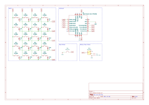

weejock
=======

Wee Jock is a 4x5 wireless keypad with smaller than normal key
spacing.  The name "Wee Jock" is a reference to Terry Pratchett's
[The Wee Free Men][weefreemen], and is meant to convey that this
keypad is more closely spaced than normal MX spacing.

The current design places the switches in a 17mm square grid, meaning
that only small square keycaps will work. ChosFox's [ChocFox][chocfox]
line of keycaps are approximately 16.5mm square, so they ought to work
fine. MBK keycaps are rectangular and will likely interfere with each
other horizontally.

Bill of Materials
-----------------

In addition to the Gerber file in [WeeJock-0-0-3-GERBER.zip](gerber/WeeJock-0-0-3-GERBER.zip), you will need:
 - 1 Seeed Studio XIAO BLE - [XIAO BLE nRF52840][xiaoble]
   - headers -OR- sockets and pins -OR- solder paste (see below)
 - 1 power switch - [PCM12][pcm12], [CUS-12TB][cus12tb], or equivalent
 - 1 reset button - [B3U-1000P][b3u1000p] or equivalent
 - 1 through-hole, right angle JST-PH-2 jack - [S2B-PH-K-S][s2bphks]
 - 1 3.7V LiPoly battery with a JST connector
 - 20 Kailh Choc v1 key switches (PG1350)
 - 20 diodes with a SOD123 footprint - [1N4148W][diode1n4148w] or equivalent
 - 20 keycaps no larger than 16.5mm by 16.5mm (for example, ChocFox CFX)

In principle, the power switch and JST connector are optional, but
highly recommended for battery operation. If you intend to always use
the keypad connected by USB, you could omit the battery entirely.

> [!WARNING]
> **Polarity Check**: Wee Jock revisions 1, 2, and 3 have the JST-PH
> jack connected to match "Adafruit-style" battery connectors: the
> positive (red) wire should be on the left when viewed from above.
>
> Not all batteries' connectors have the same polarity, so check
> carefully before plugging one in!

If you are hand-soldering, you will need headers for the controller,
as well as pogo pins for the RST and BAT+ pins.
 - 2 seven-pin headers - [PH1-07-UA][ph107ua] (or you can cut longer headers down to size)
   - alternatively you can use sockets such as the [Preci-Dip 310][sockets] series
   - and straight pins such as [Mill-Max 3320][straightpins]
 - 2 spring pins of a height to match the headers - [Mill-Max 0906][pogo0906]

If you intend to surface mount the controller, you will need a way to
handle the RST and BAT+ pads on the back, such as solder paste and a
rework station (or at least a hotplate).

TODO:
 - find a nice way to print a 2D color render of the PCB for inclusion in this README

[weefreemen]: https://en.wikipedia.org/wiki/The_Wee_Free_Men "The Wee Free Men"
[chocfox]: https://chosfox.com/collections/low-profile-keycaps/products/chocfox-bow?variant=43632218767554
[xiaoble]: https://www.seeedstudio.com/Seeed-XIAO-BLE-nRF52840-p-5201.html
[pcm12]: https://www.digikey.com/en/products/detail/c-k/PCM12SMTR/1640112
[cus12tb]: https://www.digikey.com/en/products/detail/nidec-components-corporation/CUS-12TB/1124222
[b3u1000p]: https://www.digikey.com/en/products/detail/omron-electronics-inc-emc-div/B3U-1000P/1534338
[s2bphks]: https://www.digikey.com/en/products/detail/jst-sales-america-inc./S2B-PH-K-S/926626
[diode1n4148w]: https://www.digikey.com/en/products/detail/smc-diode-solutions/1N4148W/6022450
[ph107ua]: https://www.digikey.com/en/products/detail/adam-tech/PH1-07-UA/9830505
[sockets]: https://www.digikey.com/en/products/detail/preci-dip/310-87-115-41-001101/3757353
[straightpins]: https://www.digikey.com/en/products/detail/mill-max-manufacturing-corp/3320-0-00-15-00-00-03-0/4147392
[pogo0906]: https://www.digikey.com/en/products/detail/mill-max-manufacturing-corp/0906-2-15-20-75-14-11-0/1147050
