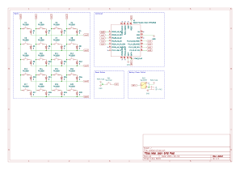

weejock
=======

Wee Jock is a 4x5 wireless keypad with smaller than normal key spacing.
The name "Wee Jock" is a reference to Terry Pratchett's [The Wee Free Men][weefreemen], and is meant to convey that this keypad is more closely spaced than normal MX spacing.

[weefreemen]: https://en.wikipedia.org/wiki/The_Wee_Free_Men "The Wee Free Men"
